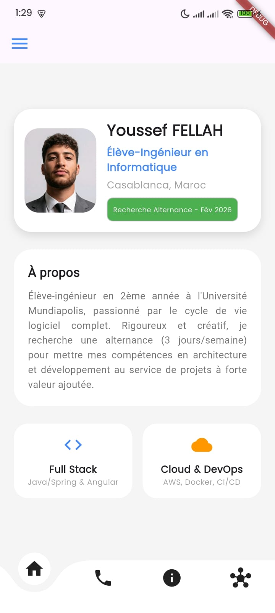
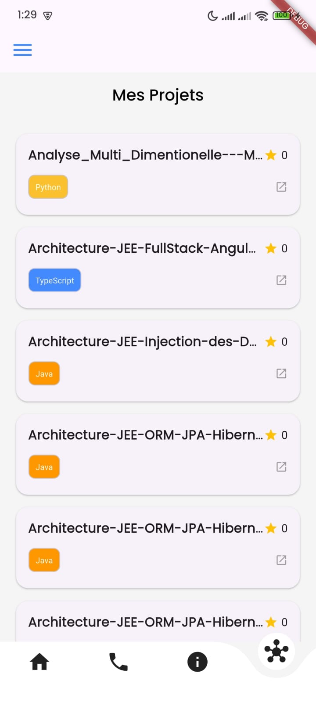
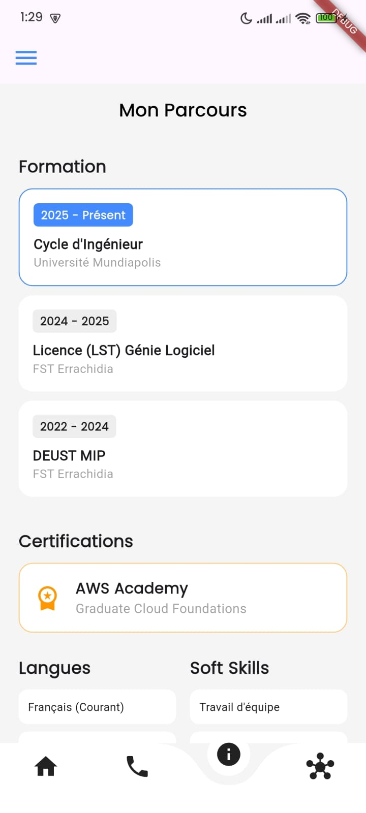
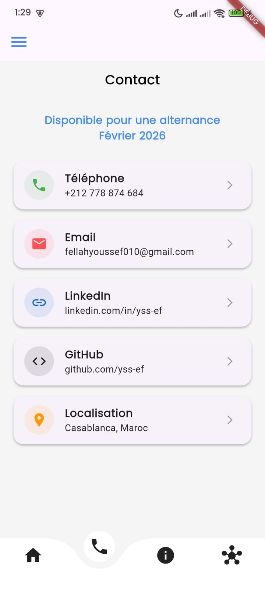

# Rapport de Projet : Application Mobile Portfolio

## 1. Présentation Générale
Ce projet consiste en une application mobile développée avec le framework **Flutter**. Elle sert de portfolio interactif pour présenter le profil de **Youssef FELLAH**, élève-ingénieur en informatique. L'application met en avant ses compétences, son parcours, ses projets personnels et propose des moyens de contact directs.

## 2. Aperçu de l'interface
Voici les captures d'écran des différentes sections de l'application :

| Accueil | Projets | Infos | Contact |
| :---: | :---: | :---: | :---: |
|  |  |  |  |

## 3. Architecture Technique
Le projet respecte une organisation structurée pour favoriser la maintenance et l'évolutivité :

- **`models/`** : Contient la classe `Project` permettant de mapper les données JSON issues de l'API GitHub.
- **`services/`** : Incorpore `ProjectService`, responsable des appels HTTP vers l'API externe.
- **`screens/`** : Regroupe les différentes pages de l'interface (Accueil, Contact, Infos, Projets).
- **`components/`** : Contient les éléments d'interface réutilisables comme le `MyDrawer`.
- **Navigation Centralisée** : Gérée dans `PrincipalPage` qui orchestre la navigation entre les écrans via une barre de navigation courbée.

## 4. Fonctionnalités Implémentées

### 4.1. Profil et Informations Personnelles
La page d'accueil affiche une présentation synthétique avec :
- Une bannière de profil incluant une photo et le statut actuel (Recherche d'alternance).
- Une section "À propos" décrivant les objectifs professionnels.
- Une vue rapide des domaines d'expertise (Full Stack, Cloud & DevOps).

### 4.2. Exploration des Projets (API GitHub)
L'application consomme dynamiquement l'API REST de GitHub :
- Récupération en temps réel des dépôts de l'utilisateur `yss-ef`.
- Affichage des détails par projet : nom, langage de programmation, description et nombre d'étoiles.
- Utilisation du package `http` pour la gestion des requêtes asynchrones.

### 4.3. Expérience Utilisateur (UX/UI)
- **Navigation Fluide** : Utilisation du package `curved_navigation_bar` pour une transition moderne entre les sections.
- **Animations** : Intégration de `flutter_animate` pour des apparitions progressives (fade, slide) des éléments de l'interface.
- **Design Adaptatif** : Utilisation de polices personnalisées (*Poppins*, *Roboto*) et de conteneurs stylisés avec ombres portées pour un aspect professionnel.

## 5. Environnement de Développement
- **Framework** : Flutter (SDK ^3.10.1)
- **Langage** : Dart
- **Dépendances Clés** :
    - `curved_navigation_bar` : Navigation stylisée.
    - `http` : Communication avec l'API GitHub.
    - `flutter_animate` & `flutter_staggered_animations` : Dynamisme visuel.
    - `url_launcher` : Interaction avec les liens externes.

## 6. Conclusion
Cette application démontre la capacité à concevoir une interface mobile moderne tout en intégrant des services tiers. Elle constitue un outil de communication efficace, alliant esthétique et fonctionnalités techniques robustes.

---
*Fait par Youssef FELLAH dans le cadre d'un examen Flutter.*